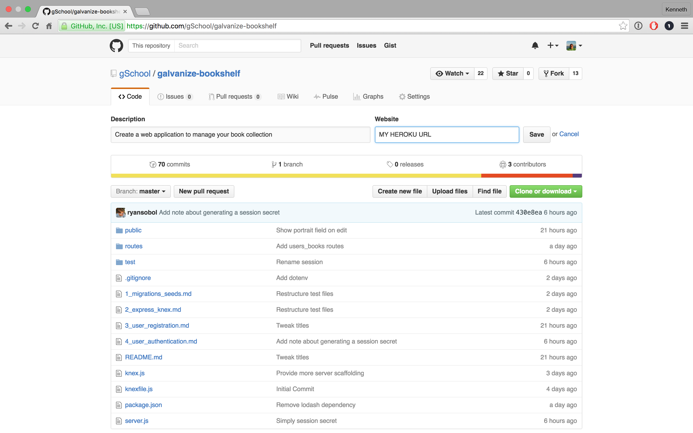

# Heroku Deployment

In this assignment, you'll deploy your database-drive, HTTP server to Heroku. Once your application is deployed, add its URL to your Github repository.

Remember to run the following shell command to generate a secret key that's used to sign each cookie session on production.

```shell
bash -c 'heroku config:set SESSION_SECRET=$(openssl rand -hex 64)'
```


